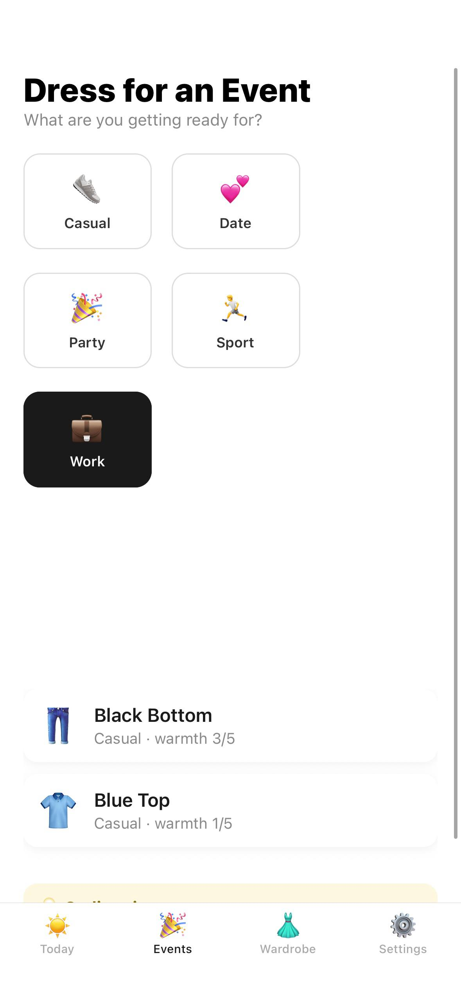
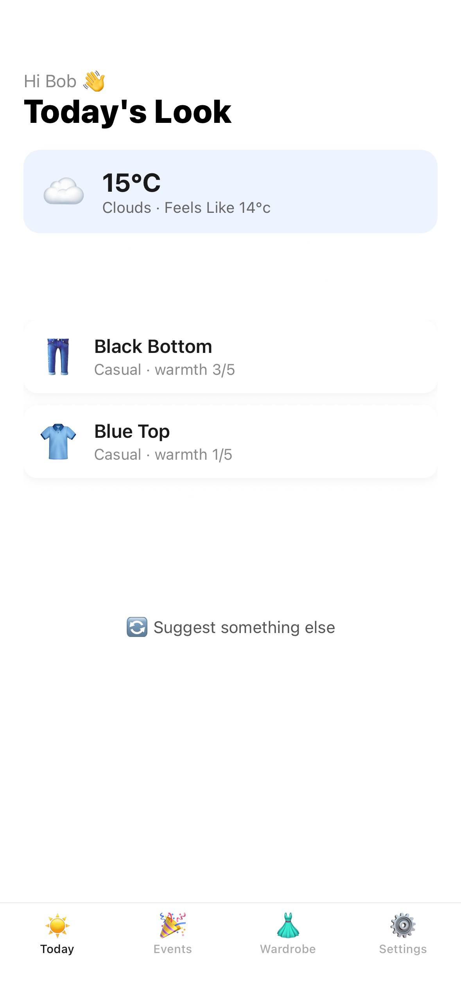
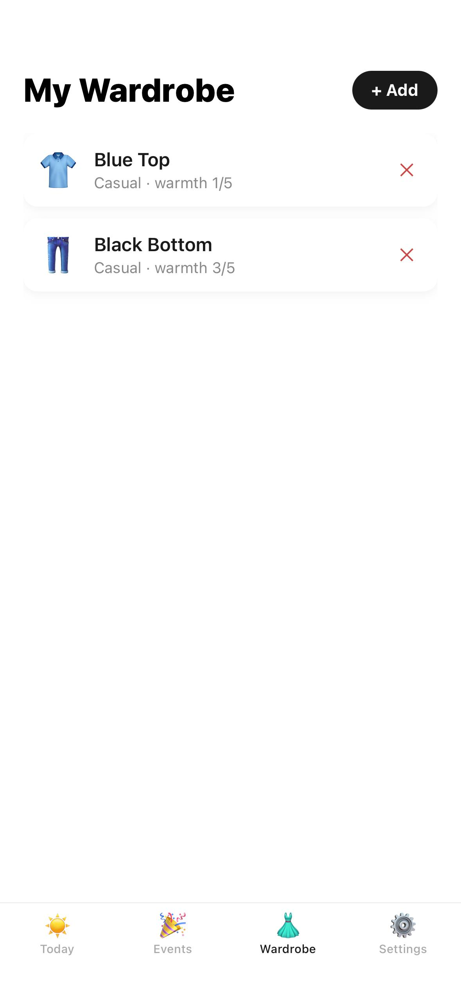
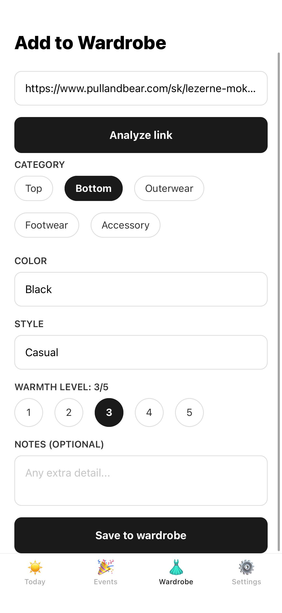

# LookCheckAI

**LookCheckAI** is an experimental mobile application for context-aware clothing recommendation.

The project explores how structured wardrobe information, environmental conditions, user preferences, and large language model reasoning can be combined to generate practical outfit recommendations from clothes that the user actually owns.

> **Project status:** Active development
> LookCheckAI is a functional prototype with authenticated accounts, a deterministic recommendation engine, and optional AI assistance. Image storage, deployment, and preference learning beyond simple feedback are still being developed.

---

## Overview

Selecting an outfit depends on more than visual compatibility.

A useful recommendation system needs to consider several types of information simultaneously:

- available clothing items;
- current weather conditions;
- clothing category and warmth;
- colors and style;
- occasion or activity;
- personal preferences;
- recently used combinations.

LookCheckAI approaches this problem as a **context-aware recommendation task**.

Instead of generating arbitrary outfit ideas, the system works with a structured representation of the user's own wardrobe and selects an appropriate combination from the available items.

---

## Screenshots

<p align="center">
  
  
  
  
</p>

<p align="center">
  <sub>Current development version. Interface elements and user flows may change during development.</sub>
</p>

---

## Design Principle

The central design decision is that **selection and explanation are separate concerns**.

Deterministic code decides *what to wear*: it filters the wardrobe by weather, enumerates plausible outfits, and scores each one for colour harmony, style coherence, warmth suitability, and repetition. A language model is then given a small shortlist of already-good outfits and asked only to choose between them and describe the result in natural language.

This has three practical consequences:

- **The application works without AI.** With no API key configured, the scoring engine still produces sensible, weather-appropriate, colour-coordinated outfits. The AI improves the output; it is not a prerequisite.
- **Model output is constrained.** The model can only return item identifiers from a pre-approved shortlist, and every identifier is validated against the user's own wardrobe before it reaches the interface. A hallucinated item is discarded, not displayed.
- **Recommendations are inspectable.** Scores are produced by readable rules, so a surprising suggestion can be traced to a specific rule rather than to opaque generation.

---

## Main Features

### Digital Wardrobe

The application maintains a structured representation of the user's clothing collection.

Wardrobe items contain:

- clothing category;
- color;
- style;
- approximate warmth level (1–5);
- optional image reference and source link;
- free-text notes used during recommendation.

The objective is to transform a collection of clothing into data that can be used programmatically by the recommendation system.

### AI-Assisted Clothing Analysis

Clothing attributes can be extracted automatically from two sources.

**From a photograph.** The image is sent to a vision model, which returns structured attributes.

**From a product link.** The backend fetches the page and extracts `schema.org/Product` JSON-LD and OpenGraph metadata rather than scraping visible text. This matters in practice: most modern storefronts render descriptions client-side, so the visible text of a fetched page is often empty, while the structured blocks that power search results and social previews are present in the served HTML. When the page exposes a product image, that image is also sent to the vision model.

```text
Clothing Image / Product Page
      │
      ▼
Structured extraction  ──►  Validation and normalisation
      │
      ▼
Structured Attributes
      │
      ├── Category
      ├── Color
      ├── Style
      └── Warmth
```

Extracted attributes are always normalised before storage: categories and styles are constrained to known values, warmth is clamped to 1–5, and text fields are length-limited. Nothing returned by a model is trusted verbatim.

Analysis requires explicit, revocable consent. Until the user opts in, no image or page content is sent to any third-party provider.

### Outfit Compatibility Engine

Outfit selection is implemented as deterministic scoring in `services/compatibility.py`.

**Colour.** Colours are classified as neutrals or accents by family. The scoring follows the rule most stylists actually apply: build on neutrals, and let at most one colour do the talking. An all-neutral palette or a single accent against neutrals scores highest; a tonal palette scores slightly lower; two competing families lower still; three or more accents are heavily penalised.

**Style.** A pairwise affinity matrix expresses how naturally two styles combine. Formal with Sport scores 0.2; Casual with Streetwear scores 0.85. An outfit's coherence is the mean affinity across its pieces, weighted against the user's stated preference.

**Warmth.** Pieces outside the day's sensible warmth band are penalised proportionally to the distance, which prevents a winter coat being suggested in mild weather simply because it is the only outerwear owned.

**Freshness.** Recently worn pieces, and pieces from outfits the user rejected, lose ground to unused ones.

Candidate outfits are enumerated combinatorially from the weather-filtered wardrobe, scored, de-duplicated, and ranked. The top-ranked outfit is the answer when no model is available; otherwise the top five are passed to the model as options.

### Context-Aware Outfit Recommendation

```text
Wardrobe
   │
   ▼
Weather filter (hard constraint)
   │
   ▼
Candidate generation
   │
   ▼
Compatibility scoring  ◄──── Occasion, Preferences, Feedback history
   │
   ▼
Ranked shortlist
   │
   ▼
Model selection and explanation  (optional)
   │
   ▼
Validation against wardrobe
   │
   ▼
Suggested outfit
```

### Weather-Aware Recommendations

Weather is contextual input rather than an independent feature. Temperature, apparent temperature, precipitation, and wind determine the acceptable warmth band and whether an outer layer is required.

The default provider is **Open-Meteo**, which requires no API key. OpenWeatherMap remains available as an alternative. Results are cached in-process per rounded coordinate pair, so repeated requests do not re-query the provider for a value that barely changes.

Weather lookup never fails the recommendation: if the provider is unreachable, a neutral fallback context is used.

### Occasion-Based Recommendations

Outfits can be requested for a specific occasion — Casual, Work, Date, Sport, or Party — each carrying a dress-code description that is factored into selection.

### Recommendation History and Feedback

Each day's look is generated once and cached. Re-opening the application returns the same recommendation rather than silently producing a different one, and an explicit action is required to request an alternative.

Outfits can be rated. Rejected outfits demote their constituent items in future scoring, which forms the first, deliberately simple version of preference learning.

---

## System Architecture

```text
LookCheckAI/
│
├── lookcheck-app/
│   └── Mobile application
│
├── lookcheck-backend/
│   └── Backend API and application logic
│
├── demo/
│   └── Application screenshots
│
├── .gitignore
├── LICENSE
└── README.md
```

```text
┌─────────────────────────┐
│     Mobile Client       │
│   React Native / Expo   │
└────────────┬────────────┘
             │
             │ REST / JSON + Bearer token
             │
             ▼
┌─────────────────────────┐
│       Flask API         │
│  Auth · Rate limiting   │
└────────────┬────────────┘
             │
     ┌───────┼───────────────┬──────────────────┐
     │       │               │                  │
     ▼       ▼               ▼                  ▼
┌──────────┐ ┌─────────────┐ ┌──────────────┐ ┌──────────────┐
│ SQLite / │ │ Compat.     │ │ AI provider  │ │ Weather      │
│ Postgres │ │ engine      │ │ (optional)   │ │ provider     │
└──────────┘ └─────────────┘ └──────────────┘ └──────────────┘
```

External services sit behind thin service modules so that individual providers can be replaced without touching application logic. The AI and weather providers are both selected by configuration at startup.

---

## Security

The prototype is not deployed, but the backend is written to production expectations in the areas where retrofitting is expensive.

**Authentication.** Accounts use email and password. Passwords are hashed with PBKDF2-HMAC-SHA256 from the standard library; sessions are stateless JWT access tokens. No third-party identity provider is required.

**Authorisation.** Every user-scoped route resolves the account from the bearer token. No endpoint accepts a user identifier from the URL, and every query that touches user-owned data filters on the owner — including the lookup that resolves item identifiers returned by a language model.

**Request forgery.** The product-link endpoint causes the server to fetch a user-supplied URL, so targets are validated: scheme is restricted to HTTP and HTTPS, hostnames are resolved, and private, loopback, link-local, and reserved addresses are rejected. Cloud metadata endpoints are unreachable by construction.

**Abuse and cost.** Every expensive endpoint is rate limited, per user where authenticated and per address otherwise. Outfit generation and AI analysis carry additional per-user daily and hourly quotas, and uploads are size-capped.

**Data protection.** Third-party AI analysis requires explicit opt-in and can be revoked. Account deletion is available inside the application and cascades to wardrobe, outfits, and feedback.

An end-to-end test script (`smoke_test.py`) exercises these behaviours against a running server, including cross-account isolation and the request-forgery protections.

---

## Technology Stack

### Mobile Application

- React Native
- Expo
- JavaScript
- React Navigation
- Expo Location
- Expo Image Picker
- AsyncStorage

### Backend

- Python
- Flask
- REST API
- SQLite (development) / PostgreSQL (production), selected by `DATABASE_URL`
- PyJWT
- Pluggable AI provider: Google Gemini or Anthropic Claude, called over HTTPS without a vendor SDK
- Pluggable weather provider: Open-Meteo (no key required) or OpenWeatherMap

### Development

- Git
- GitHub
- VS Code
- REST-based client-server communication

---

## Repository Structure

```text
LookCheckAI/
│
├── demo/
│   ├── demo-1.jpg
│   ├── demo-2.jpg
│   ├── demo-3.jpg
│   └── demo-4.jpg
│
├── lookcheck-app/
│   ├── src/
│   │   ├── api/client.js          # API client, bearer token handling
│   │   ├── components/            # Clothing card, colourway strip, weather
│   │   ├── context/AuthContext.js # Session state
│   │   ├── screens/
│   │   ├── config.js              # Backend URL resolution
│   │   └── theme.js               # Design tokens
│   ├── App.js
│   ├── app.json
│   └── package.json
│
├── lookcheck-backend/
│   ├── services/
│   │   ├── ai_service.py          # Provider transport, extraction, generation
│   │   ├── compatibility.py       # Colour and style scoring
│   │   └── weather_service.py     # Weather providers and caching
│   ├── app.py                     # Routes
│   ├── auth.py                    # Passwords, tokens, route guard
│   ├── security.py                # Rate limiting, URL validation
│   ├── config.py                  # Configuration and validation
│   ├── database.py                # Data access
│   ├── schema.sqlite.sql
│   ├── schema.postgres.sql
│   ├── smoke_test.py              # End-to-end API test
│   ├── list_gemini_models.py      # Diagnostic helper
│   ├── Dockerfile
│   ├── requirements.txt
│   └── .env.example
│
├── .gitignore
├── LICENSE
└── README.md
```

---

## Running the Project

### Backend

```bash
cd lookcheck-backend
pip install -r requirements.txt
cp .env.example .env
```

Every setting has a working default, so the application starts with an empty configuration file. Only `JWT_SECRET` is required, and only in production:

```env
JWT_SECRET=
DATABASE_URL=sqlite:///lookcheck.db

# Optional. Without a key the application runs on the scoring engine alone.
GEMINI_API_KEY=
GEMINI_MODEL=gemini-3.5-flash-lite

# Optional. Open-Meteo is used by default and needs no key.
WEATHER_PROVIDER=open-meteo
```

Generate a secret with:

```bash
python -c "import secrets; print(secrets.token_hex(32))"
```

Start the server:

```bash
python app.py
```

The startup line reports the active configuration, for example `(ai=gemini, weather=open-meteo)`.

Verify the installation against a running server:

```bash
python smoke_test.py
```

### Mobile Application

```bash
cd lookcheck-app
npm install
npx expo start
```

During development the backend address is detected automatically from the Expo development server, so no address needs to be configured as long as both run on the same machine. For a production build, set `extra.apiBaseUrl` in `app.json` or the `EXPO_PUBLIC_API_URL` environment variable.

Requires Node.js 20.19.4 or newer.

---

## Development Status

LookCheckAI is **not production-ready**.

The repository represents an engineering prototype used to develop and test the overall system architecture and recommendation workflow.

| Component | Status |
|---|---|
| Mobile UI | Implemented |
| Navigation and main user flows | Implemented |
| Digital wardrobe | Implemented |
| Clothing storage | Implemented |
| Authentication and account management | Implemented |
| Weather integration | Implemented |
| Outfit compatibility scoring | Implemented |
| Occasion-aware recommendations | Implemented |
| Recommendation history | Implemented |
| Feedback capture | Implemented |
| AI clothing analysis | Experimental |
| AI outfit explanation | Experimental |
| Preference learning | Basic |
| Image storage | Not implemented |
| Automated unit testing | Planned |
| Production deployment | Not available |

---

## Current Limitations

### Image Storage

Photographs used for clothing analysis are not retained. Items added from a product link keep the store's image URL, but items photographed by the user are represented by a colour swatch. Persistent image storage is the next significant piece of work.

### Recommendation Evaluation

The scoring rules encode conventional styling heuristics but have not been evaluated against a formal fashion compatibility benchmark or a human-labelled dataset.

Recommendations should be interpreted as experimental system outputs rather than objectively optimal clothing combinations.

### AI Reliability

Attribute extraction relies on generative AI, whose output is probabilistic and may misinterpret garments. Extraction is normalised and validated, and outfit selection is constrained to a pre-scored shortlist, but attribute errors still propagate into recommendations.

### Clothing Representation

The current representation uses a limited collection of attributes. Possible future additions include material, fit, season, pattern, layering compatibility, formality, garment condition, and learned image embeddings.

### Personalization

Preference learning is currently limited to demoting items from rejected outfits. Longer-term modelling of preferred colours, combinations, and weather tolerance is not yet implemented.

### Persistence and Scale

Rate-limit counters are held in process memory, so they reset on restart and are counted per worker. A multi-worker deployment would need shared storage for them.

### External Services

Availability, latency, API limits, and changes to third-party providers may affect application behavior. Both the AI and weather layers degrade to functioning defaults when a provider is unavailable.

---

## Planned Development

- persistent image storage and thumbnails;
- background removal for clothing images;
- production deployment configuration;
- pattern and material attributes;
- multi-day outfit planning;
- seasonal wardrobe analysis;
- wardrobe statistics and neglected-item detection;
- richer preference modelling from accumulated feedback;
- automated unit tests alongside the existing end-to-end suite;
- shared rate-limit storage for multi-worker deployment.

---

## Research and Engineering Direction

LookCheckAI is primarily an engineering project, but several aspects of the problem are relevant to recommender systems and applied artificial intelligence.

The project provides a practical environment for experimenting with:

- multimodal information processing;
- structured extraction from images and web pages;
- context-aware recommendation;
- constrained recommendation;
- LLM-assisted reasoning;
- explainable recommendations;
- user preference modelling;
- human-AI interaction;
- mobile AI application architecture.

The central design question is how much of the recommendation process should be performed by deterministic software and how much delegated to a generative model.

A purely generative system is flexible but difficult to evaluate and control. A purely rule-based system is predictable but may struggle with semantic concepts such as style compatibility.

LookCheckAI resolves this by giving each side the work it is better suited to: explicit constraints and scoring define and rank the candidate space, while the model contributes interpretation and explanation over an already-validated shortlist. The practical test of this split is that removing the model degrades the output rather than breaking it.

---

## Purpose

LookCheckAI is developed as:

- an experimental AI application;
- a full-stack engineering project;
- a platform for studying recommendation logic;
- a practical implementation of AI-assisted mobile functionality;
- a portfolio project demonstrating the integration of mobile development, backend engineering, APIs, structured data, and applied AI.

The emphasis is on building and understanding the complete system rather than presenting the current prototype as a finished commercial product.

---

## Disclaimer

LookCheckAI is an experimental project.

Recommendations produced by the application are subjective and should not be treated as professional fashion advice.

Features, architecture, APIs, database structures, and user interfaces may change during development.

---

## License

All rights reserved.

The source code is publicly available for demonstration and portfolio purposes.

Unless explicitly stated otherwise, permission is not granted to copy, modify, distribute, sublicense, or reuse the source code or associated project materials.

See [`LICENSE`](LICENSE) for additional information.