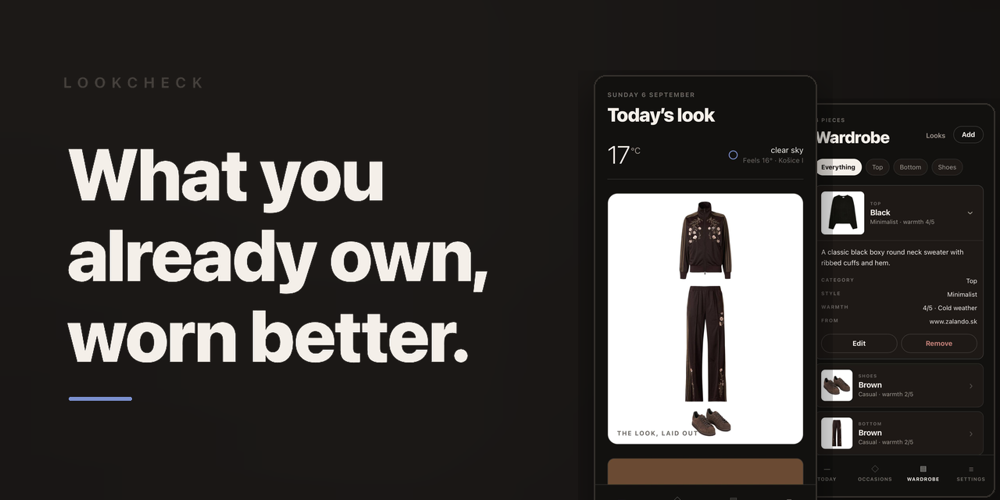
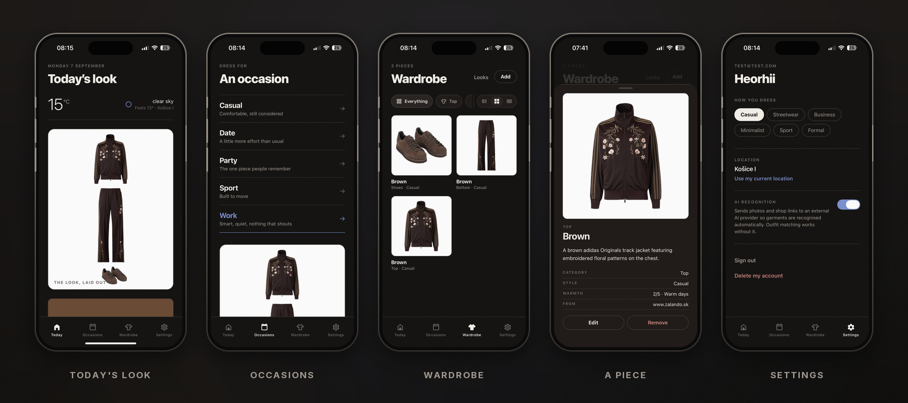

  

# LookCheckAI

**Tells you what to wear from the clothes you already own.**

Most styling apps are shops — they recommend what to buy. This one starts from the wardrobe you have and answers the morning question: what goes with what, given today's weather and where you're going.

  

---

## What it does

https://github.com/user-attachments/assets/b6fc2104-f051-46a0-9ae9-c0ce191c52b3

**Add a piece four ways** — photograph it, paste a shop link, attach your own picture, or type it in. A vision model reads the garment and fills in category, colour, style and warmth.

**Get an outfit every morning** — matched to the weather, the occasion, and what you wore recently.

**See it, not read it** — the look is drawn as it would be worn, from your own photographs, laid out like a flat lay.

**Save your own combinations** — build a look by hand and wear it in one tap.

---

## How it is built

Deterministic code decides *what* to wear; the AI only explains it.

Rules filter the wardrobe by weather, enumerate outfits and score them for colour harmony, style coherence and repetition. The model gets a shortlist of already-good options and picks one. **Turn the AI off and the app still works** — it just stops explaining itself.

The picture works the same way: **composed, not generated**. Every garment shown is your own photo, moved and scaled but never redrawn. A generated render would look better and would quietly invent clothes you don't own.

**Stack** — React Native · Expo · Flask · Postgres · Pillow + rembg. AI, weather and search providers are all pluggable and each falls back to a working default.

<b>Engineering detail</b>

 

**Image pipeline.** Uploads are cropped to the garment's bounding box *before* background removal — the crop takes out the head and legs, segmentation takes out the room. One pass yields two artefacts: a square tile for wardrobe cards, and a cut-out trimmed exactly to the garment, so its pixel dimensions are the garment's own proportions. Results are checked: a flat block of colour or a near-empty frame is rejected rather than saved.

**Composition.** Garments are sized by where they join — the hem of the top at the waist of the trousers, the trouser hems on the shoes. The backend measures how wide each cut-out is at its top and bottom edge; only the top is given a size and everything below is scaled so its opening matches the hem above. Baggy trousers therefore come out wider than skinny ones without any garment types or thresholds.

**Scoring.** Colours are neutrals or accents by family — build on neutrals, let at most one colour talk. Styles have a pairwise affinity matrix: Formal with Sport scores 0.2, Casual with Streetwear 0.85. Warmth is penalised by distance from the day's band. On a cool day the engine pairs a mid-weight top over a lighter one — nothing says "t-shirt" in the data, but warmth does.

**Shop links.** Pasted text is normalised first: URL extracted from a shared message, app deep links converted, shorteners followed, campaign parameters stripped. Pages are read for `schema.org/Product` and OpenGraph metadata rather than scraped — most storefronts render descriptions client-side, so visible text is empty while the structured blocks sit in the served HTML.

**Product lookup.** If a garment is recognisable, the shop's photo of it makes a better tile. The model reads the brand, the name is searched, and the candidate photo is shown *alongside yours* to confirm it is the same thing. Nothing is substituted without you saying so. Reverse image search is avoided deliberately: it returns what looks *similar*, and a plain black t-shirt matches a thousand others.

**Security.** PBKDF2 password hashing, stateless JWT sessions, every query scoped to the owner — including the one that resolves item ids returned by a language model. URLs the server fetches are validated against private and metadata addresses, with every redirect hop checked, not just the first. Rate limits and per-user quotas on everything that costs money. AI analysis is opt-in and revocable; account deletion cascades and removes stored images.

---

## Status

Working: accounts, wardrobe, image processing, composition, weather, scoring, saved looks, history and feedback.

Experimental: AI recognition and explanation, product lookup.

Not there yet: **deployment** — the backend still runs on a development machine, which is the one thing between this and other people using it.

## Next

Hosted backend and object storage · release on iOS and Android · real preference learning from the feedback already being collected · multi-day planning · wardrobe insight, such as what hasn't been worn in months and which colour would unlock the most new outfits · garment-specific segmentation.

---

All rights reserved — public for demonstration and portfolio purposes.  See [`LICENSE`](LICENSE). Recommendations are subjective and not professional styling advice.
