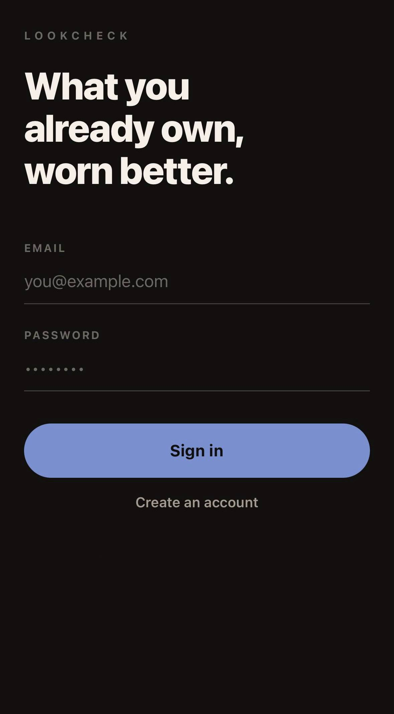

# LookCheckAI

**LookCheckAI** is an experimental mobile application for context-aware clothing recommendation.

The project explores how structured wardrobe information, environmental conditions, user preferences, and large language model reasoning can be combined to generate practical outfit recommendations from clothes that the user actually owns.

> **Project status:** Active development
> LookCheckAI is a functional prototype with authenticated accounts, a deterministic recommendation engine, image processing, saved outfits, and optional AI assistance. Cloud deployment and richer preference learning are still being developed.

---

## Overview

Selecting an outfit depends on more than visual compatibility.

A useful recommendation system needs to consider several types of information simultaneously:

- available clothing items;
- current weather conditions;
- clothing category and warmth;
- colours and style;
- occasion or activity;
- personal preferences;
- recently used combinations.

LookCheckAI approaches this problem as a **context-aware recommendation task**.

Instead of generating arbitrary outfit ideas, the system works with a structured representation of the user's own wardrobe and selects an appropriate combination from the available items.

---

<p align="center">
  
</p>

## Demo

A full tour of the app: the daily look, dressing for an occasion, the wardrobe, building a look by hand, and the four ways to add a piece.

https://github.com/user-attachments/assets/2adbd5ab-5e77-41e9-a622-f2af31128529

<details>
<summary><b>By feature</b></summary>

<br>

**Today's look** — the outfit laid out as it would be worn, with the reasoning behind it

https://github.com/user-attachments/assets/5d877023-bb9f-4d67-911d-afc9d1ddc23f

**Occasions** — the same wardrobe read against a dress code

https://github.com/user-attachments/assets/236995cb-eb67-4f17-8d52-2261c8835d99

**Wardrobe** — browsing pieces and editing one

https://github.com/user-attachments/assets/54426204-d66d-4234-b707-323cc9c6a872

**Building a look** — putting a combination together by hand and saving it

https://github.com/user-attachments/assets/90c88590-4d40-4e93-bef3-1a6baa6596b9

**Adding a piece** — by photograph, by shop link, or by hand

https://github.com/user-attachments/assets/636db161-2f6c-457d-8768-9490b5b7f7a3

</details>

<p align="center">
  <sub>Recorded on a development build. Interface elements and user flows may change.</sub>
</p>

---

## Design Principle

The central design decision is that **selection and explanation are separate concerns**.

Deterministic code decides *what to wear*: it filters the wardrobe by weather, enumerates plausible outfits, and scores each one for colour harmony, style coherence, warmth suitability, and repetition. A language model is then given a small shortlist of already-good outfits and asked only to choose between them and describe the result in natural language.

This has three practical consequences:

- **The application works without AI.** With no API key configured, the scoring engine still produces sensible, weather-appropriate, colour-coordinated outfits. The AI improves the output; it is not a prerequisite.
- **Model output is constrained.** The model can only return item identifiers from a pre-approved shortlist, and every identifier is validated against the user's own wardrobe before it reaches the interface. A hallucinated item is discarded, not displayed.
- **Recommendations are inspectable.** Scores are produced by readable rules, so a surprising suggestion can be traced to a specific rule rather than to opaque generation.

The same principle governs the visual side. The outfit picture is **composed, not generated**: every garment shown is the user's own photograph, moved and scaled but never redrawn. A generative render would look better and would quietly invent clothes that are not in the wardrobe, which is the one thing this application must not do.

---

## Main Features

### Digital Wardrobe

The application maintains a structured representation of the user's clothing collection.

Wardrobe items contain:

- clothing category;
- colour;
- style;
- approximate warmth level (1–5);
- a normalised catalogue tile and a transparent cut-out;
- optional source link;
- free-text notes used during recommendation.

Cards expand in place to show the full detail of a piece and open an editor where every attribute, including the photograph, can be changed.

### Adding a Piece

Four routes, all producing the same structured record.

**By photograph.** A vision model identifies every garment in the frame and returns a bounding box for each. Several garments in one photo produce a chooser rather than a guess.

**By shop link.** Pasted text is normalised first: the URL is extracted from a shared message, app deep links (`intent://`, `wbapp://`) are converted to web addresses, shorteners are followed, and campaign parameters are stripped. The page is then read for `schema.org/Product` JSON-LD and OpenGraph metadata rather than scraped for visible text — most storefronts render descriptions client-side, so the visible text is often empty while the structured blocks that power search results and social previews are present in the served HTML. Product galleries are collected from the whole document, including the JSON blobs galleries are configured with, and the model is asked which photograph shows the garment without a person in it.

**By own photograph.** A picture attached by hand, with no AI involved and no consent required — nothing leaves the server.

**By hand.** Typed attributes, no AI at all.

```text
Photograph / Product page / Manual entry
      │
      ▼
Structured extraction  ──►  Validation and normalisation
      │
      ▼
Structured Attributes
      │
      ├── Category
      ├── Colour
      ├── Style
      └── Warmth
```

Extracted attributes are always normalised before storage: categories and styles are constrained to known values, warmth is clamped to 1–5, and text fields are length-limited. Nothing returned by a model is trusted verbatim.

Analysis requires explicit, revocable consent. Until the user opts in, no image or page content is sent to any third-party provider.

### Image Processing

Whatever is uploaded — a mirror selfie, a shop screenshot, a product photograph — becomes a uniform catalogue tile.

```text
load and validate
   -> crop to the garment's bounding box
   -> separate garment from background
   -> trim to the remaining subject
   -> pad proportionally to the object's own size
   -> centre on a square canvas
   -> resize to one fixed output size
   -> quality check
   -> save
```

Cropping to the garment's box *before* segmentation is what makes this work on photographs of people: the crop removes the head and legs, and segmentation then removes the room.

Two artefacts come out of a single pass: a tile for wardrobe cards, and a transparent cut-out trimmed exactly to the garment. The cut-out's pixel dimensions are therefore the garment's own proportions, which is what the outfit composition needs in order to place it.

Results are assessed rather than assumed. A near-empty frame, a flat block of colour, or a subject filling the canvas edge to edge is rejected with an explanation instead of being saved — a bad tile is worse than an honest error.

### Product Lookup

A phone snap of a jumper on a bed makes a poor wardrobe tile. If the garment is recognisable, the shop's photograph of it is better.

The vision model reads the garment — brand, model, distinguishing details — the name is searched for, the product page is parsed by the same code that handles pasted links, and the candidate photograph is shown to the model *alongside the user's own* to check they are the same thing.

Nothing is substituted automatically. Both photographs are shown side by side and the user decides. An unrecognisable garment simply keeps its own picture, which is the correct outcome rather than a failure.

This deliberately avoids reverse image search. There is no usable public one — Google Lens has no API, and Google's Vision Product Search matches against a catalogue you supply rather than the open web. More importantly, reverse image search returns what looks *similar*: a plain black t-shirt matches a thousand other black t-shirts, and filing someone else's t-shirt in a wardrobe breaks the promise the application makes.

### Outfit Compatibility Engine

Outfit selection is implemented as deterministic scoring in `services/compatibility.py`.

**Colour.** Colours are classified as neutrals or accents by family. The scoring follows the rule most stylists actually apply: build on neutrals, and let at most one colour do the talking. An all-neutral palette or a single accent against neutrals scores highest; a tonal palette scores slightly lower; two competing families lower still; three or more accents are heavily penalised.

**Style.** A pairwise affinity matrix expresses how naturally two styles combine. Formal with Sport scores 0.2; Casual with Streetwear scores 0.85. An outfit's coherence is the mean affinity across its pieces, weighted against the user's stated preference.

**Warmth.** Pieces outside the day's sensible warmth band are penalised proportionally to the distance, which prevents a winter coat being suggested in mild weather simply because it is the only outerwear owned.

**Layering.** On a cool day the engine looks for a mid-weight top to lead and a lighter one to go underneath. Nothing in the data says "t-shirt" or "sweatshirt", but warmth already does, so no re-tagging is needed.

**Freshness.** Recently worn pieces, and pieces from outfits the user rejected, lose ground to unused ones.

Candidate outfits are enumerated combinatorially from the weather-filtered wardrobe, scored, de-duplicated, and ranked. The top-ranked outfit is the answer when no model is available; otherwise the top five are passed to the model as options.

### Outfit Composition

The chosen outfit is drawn as it would be worn, without anyone wearing it.

Garments are sized by **where they join**. Flat-lay photographers lay pieces in their natural wear relationship — the hem of the top at the waist of the trousers, the trouser hems on the shoes — and what makes that read as one body is not the size of each piece but that the pieces meet. So the backend measures, for every cut-out, how wide the garment is at its top and bottom edge and where that edge sits horizontally. Only the top is given a size; everything below is scaled so its opening matches the hem above it.

A pair of baggy trousers is then automatically wider than a skinny pair, because its waist is a smaller share of its own width — no garment types, no thresholds, no table of measurements to keep tuning. Pieces are aligned by the seam rather than the bounding box, so trousers photographed with the legs swung to one side still hang from the waist.

Two tops are drawn as two layers. Accessories are placed where they sit on a body: a chain at the collar, a ring at the hand, a belt at the waist.

### Context-Aware Outfit Recommendation

```text
Wardrobe
   │
   ▼
Weather filter (hard constraint)
   │
   ▼
Candidate generation, including layering
   │
   ▼
Compatibility scoring  ◄──── Occasion, Preferences, Feedback history
   │
   ▼
Ranked shortlist
   │
   ▼
Model selection and explanation  (optional)
   │
   ▼
Validation against wardrobe
   │
   ▼
Suggested outfit  ──►  Composition
```

### Weather-Aware Recommendations

Weather is contextual input rather than an independent feature. Temperature, apparent temperature, precipitation, and wind determine the acceptable warmth band, whether an outer layer is required, and whether layering makes sense.

The default provider is **Open-Meteo**, which requires no API key. OpenWeatherMap remains available as an alternative. Results are cached in-process per rounded coordinate pair, so repeated requests do not re-query the provider for a value that barely changes.

Weather lookup never fails the recommendation: if the provider is unreachable, a neutral fallback context is used.

### Occasion-Based Recommendations

Outfits can be requested for a specific occasion — Casual, Work, Date, Sport, or Party — each carrying a dress-code description that is factored into selection.

### Saved Looks

Combinations can also be assembled by hand. The composition updates as pieces are tapped, so a look is judged by looking at it rather than by reading a list of names.

A saved look can be worn in one tap, which writes the same record the recommender does — so it appears on the Today screen, counts as worn, and feeds the same history and feedback as a generated one. Removing a garment from the wardrobe removes it from every look that used it.

### Recommendation History and Feedback

Each day's look is generated once and cached. Re-opening the application returns the same recommendation rather than silently producing a different one, and an explicit action is required to request an alternative.

Outfits can be rated. Rejected outfits demote their constituent items in future scoring, which forms the first, deliberately simple version of preference learning.

---

## System Architecture

```text
┌─────────────────────────┐
│     Mobile Client       │
│   React Native / Expo   │
└────────────┬────────────┘
             │
             │ REST / JSON + Bearer token
             │
             ▼
┌─────────────────────────┐
│       Flask API         │
│  Auth · Rate limiting   │
└────────────┬────────────┘
             │
   ┌─────────┼──────────┬──────────────┬──────────────┬──────────────┐
   ▼         ▼          ▼              ▼              ▼              ▼
┌────────┐ ┌────────┐ ┌──────────┐ ┌──────────┐ ┌──────────┐ ┌──────────┐
│SQLite/ │ │Compat. │ │  Image   │ │    AI    │ │ Weather  │ │  Search  │
│Postgres│ │ engine │ │ pipeline │ │(optional)│ │ provider │ │(optional)│
└────────┘ └────────┘ └──────────┘ └──────────┘ └──────────┘ └──────────┘
```

External services sit behind thin service modules so that individual providers can be replaced without touching application logic. The AI, weather, and search providers are all selected by configuration at startup, and each degrades to a working default when unavailable.

---

## Security

The prototype is not deployed, but the backend is written to production expectations in the areas where retrofitting is expensive.

**Authentication.** Accounts use email and password. Passwords are hashed with PBKDF2-HMAC-SHA256 from the standard library; sessions are stateless JWT access tokens. No third-party identity provider is required.

**Authorisation.** Every user-scoped route resolves the account from the bearer token. No endpoint accepts a user identifier from the URL, and every query that touches user-owned data filters on the owner — including the lookup that resolves item identifiers returned by a language model.

**Request forgery.** Several endpoints cause the server to fetch a user-supplied URL, so targets are validated: scheme is restricted to HTTP and HTTPS, hostnames are resolved, and private, loopback, link-local, and reserved addresses are rejected. Redirects are followed one hop at a time with every intermediate address checked the same way — a shortener on a respectable domain redirecting to a cloud metadata endpoint is the case a first-URL-only check would wave through.

**Abuse and cost.** Every expensive endpoint is rate limited, per user where authenticated and per address otherwise. Outfit generation and AI analysis carry additional per-user daily and hourly quotas, and uploads are size-capped.

**Data protection.** Third-party AI analysis requires explicit opt-in and can be revoked. Account deletion is available inside the application and cascades to wardrobe, outfits, saved looks, and feedback; stored images are removed with the items that own them.

An end-to-end test script (`smoke_test.py`) exercises these behaviours against a running server, including cross-account isolation and the request-forgery protections.

---

## Technology Stack

### Mobile Application

- React Native
- Expo
- JavaScript
- React Navigation
- React Native Reanimated
- Expo Location
- Expo Image Picker
- AsyncStorage

### Backend

- Python
- Flask
- REST API
- SQLite (development) / PostgreSQL (production), selected by `DATABASE_URL`
- PyJWT
- Pillow and rembg for the image pipeline
- Pluggable AI provider: Google Gemini or Anthropic Claude, called over HTTPS without a vendor SDK
- Pluggable weather provider: Open-Meteo (no key required) or OpenWeatherMap
- Pluggable search provider for product lookup

### Development

- Git
- GitHub
- VS Code

---

## Repository Structure

```text
LookCheckAI/
│
├── demo/
│   └── poster.png
│
├── lookcheck-app/
│   ├── src/
│   │   ├── api/client.js            # API client, bearer token handling
│   │   ├── components/
│   │   │   ├── ClothingCard.js      # Expandable garment row
│   │   │   ├── ColorwayStrip.js     # An outfit's palette as a swatch card
│   │   │   ├── OutfitCard.js
│   │   │   ├── OutfitComposition.js # The look, laid out
│   │   │   ├── ProductMatchPrompt.js
│   │   │   └── WeatherBadge.js
│   │   ├── context/AuthContext.js   # Session state
│   │   ├── screens/
│   │   │   ├── AddItemScreen.js
│   │   │   ├── EditItemScreen.js
│   │   │   ├── EventLookScreen.js
│   │   │   ├── LookBuilderScreen.js
│   │   │   ├── LooksScreen.js
│   │   │   ├── LoginScreen.js
│   │   │   ├── RegisterScreen.js
│   │   │   ├── SettingsScreen.js
│   │   │   ├── TodayLookScreen.js
│   │   │   └── WardrobeScreen.js
│   │   ├── config.js                # Backend URL resolution
│   │   └── theme.js                 # Design tokens
│   ├── App.js
│   ├── app.json
│   └── package.json
│
├── lookcheck-backend/
│   ├── services/
│   │   ├── ai_service.py            # Provider transport, extraction, generation
│   │   ├── compatibility.py         # Colour and style scoring
│   │   ├── image_service.py         # Cut-outs, tiles, join measurement
│   │   ├── link_service.py          # URL extraction, deep links, redirects
│   │   ├── product_lookup.py        # Identify a garment, find its photo
│   │   └── weather_service.py       # Weather providers and caching
│   ├── app.py                       # Routes
│   ├── auth.py                      # Passwords, tokens, route guard
│   ├── security.py                  # Rate limiting, URL validation
│   ├── config.py                    # Configuration and validation
│   ├── database.py                  # Data access and migrations
│   ├── schema.sqlite.sql
│   ├── schema.postgres.sql
│   ├── smoke_test.py                # End-to-end API test
│   ├── rebuild_cutouts.py           # Maintenance: repair stored cut-outs
│   ├── list_gemini_models.py        # Diagnostic helper
│   ├── Dockerfile
│   ├── requirements.txt
│   └── .env.example
│
├── .gitignore
├── LICENSE
└── README.md
```

---

## Running the Project

### Backend

```bash
cd lookcheck-backend
pip install -r requirements.txt
cp .env.example .env
```

Every setting has a working default, so the application starts with an empty configuration file. Only `JWT_SECRET` is required, and only in production:

```env
JWT_SECRET=
DATABASE_URL=sqlite:///lookcheck.db

# Optional. Without a key the application runs on the scoring engine alone.
GEMINI_API_KEY=
GEMINI_MODEL=gemini-3.5-flash-lite

# Optional. Open-Meteo is used by default and needs no key.
WEATHER_PROVIDER=open-meteo

# Optional. Product lookup; no key needed for the default provider.
SEARCH_PROVIDER=duckduckgo
```

Generate a secret with:

```bash
python -c "import secrets; print(secrets.token_hex(32))"
```

Start the server:

```bash
python app.py
```

The startup line reports the active configuration, for example `(ai=gemini, weather=open-meteo)`. The segmentation model downloads on first use and is about 4.5 MB.

Verify the installation against a running server:

```bash
python smoke_test.py
```

### Mobile Application

```bash
cd lookcheck-app
npm install
npx expo start
```

During development the backend address is detected automatically from the Expo development server, so no address needs to be configured as long as both run on the same machine. For a production build, set `extra.apiBaseUrl` in `app.json` or the `EXPO_PUBLIC_API_URL` environment variable.

Requires Node.js 20.19.4 or newer.

---

## Development Status

LookCheckAI is **not production-ready**.

The repository represents an engineering prototype used to develop and test the overall system architecture and recommendation workflow.

| Component | Status |
|---|---|
| Mobile UI | Implemented |
| Navigation and main user flows | Implemented |
| Digital wardrobe | Implemented |
| Authentication and account management | Implemented |
| Image storage and processing | Implemented |
| Outfit composition | Implemented |
| Weather integration | Implemented |
| Outfit compatibility scoring | Implemented |
| Layering | Implemented |
| Occasion-aware recommendations | Implemented |
| Saved looks | Implemented |
| Recommendation history | Implemented |
| Feedback capture | Implemented |
| AI clothing analysis | Experimental |
| AI outfit explanation | Experimental |
| Product lookup | Experimental |
| Preference learning | Basic |
| Automated unit testing | Planned |
| Object storage for images | Planned |
| Production deployment | Not available |

---

## Current Limitations

### Garment Segmentation

Background removal uses a general subject-segmentation model, not a garment-specific one. It separates subject from background; it does not know a t-shirt from the arms inside it. Cropping to the garment's box before segmentation handles most of this, but a sliver of arm occasionally survives. A garment-specific model would fix it at roughly a hundred times the memory.

### Image Storage

Processed images are written to local disk, which suits development and is wrong for most hosting, where the filesystem is wiped on redeploy. Moving to object storage means replacing one function.

### Product Lookup

Only recognisable branded garments can be found. A plain unbranded piece will not be, which is the expected outcome. The default search provider is scraped HTML and can break without warning; a keyed provider is available for anyone who needs reliability.

### Recommendation Evaluation

The scoring rules encode conventional styling heuristics but have not been evaluated against a formal fashion compatibility benchmark or a human-labelled dataset.

Recommendations should be interpreted as experimental system outputs rather than objectively optimal clothing combinations.

### AI Reliability

Attribute extraction relies on generative AI, whose output is probabilistic and may misinterpret garments. Extraction is normalised and validated, and outfit selection is constrained to a pre-scored shortlist, but attribute errors still propagate into recommendations.

### Clothing Representation

The current representation uses a limited collection of attributes. Possible future additions include material, fit, season, pattern, layering compatibility, formality, garment condition, and learned image embeddings.

### Personalization

Preference learning is currently limited to demoting items from rejected outfits. Longer-term modelling of preferred colours, combinations, and weather tolerance is not yet implemented.

### Persistence and Scale

Rate-limit counters are held in process memory, so they reset on restart and are counted per worker. A multi-worker deployment would need shared storage for them.

### External Services

Availability, latency, API limits, and changes to third-party providers may affect application behaviour. The AI, weather, and search layers all degrade to functioning defaults when a provider is unavailable.

---

## Planned Development

- object storage for processed images;
- production deployment configuration;
- garment-specific segmentation;
- pattern and material attributes;
- multi-day outfit planning;
- seasonal wardrobe analysis;
- wardrobe statistics and neglected-item detection;
- richer preference modelling from accumulated feedback;
- automated unit tests alongside the existing end-to-end suite;
- shared rate-limit storage for multi-worker deployment.

---

## Research and Engineering Direction

LookCheckAI is primarily an engineering project, but several aspects of the problem are relevant to recommender systems and applied artificial intelligence.

The project provides a practical environment for experimenting with:

- multimodal information processing;
- structured extraction from images and web pages;
- context-aware recommendation;
- constrained recommendation;
- LLM-assisted reasoning;
- explainable recommendations;
- user preference modelling;
- human-AI interaction;
- mobile AI application architecture.

The central design question is how much of the recommendation process should be performed by deterministic software and how much delegated to a generative model.

A purely generative system is flexible but difficult to evaluate and control. A purely rule-based system is predictable but may struggle with semantic concepts such as style compatibility.

LookCheckAI resolves this by giving each side the work it is better suited to: explicit constraints and scoring define and rank the candidate space, while the model contributes interpretation and explanation over an already-validated shortlist. The practical test of this split is that removing the model degrades the output rather than breaking it.

---

## Purpose

LookCheckAI is developed as:

- an experimental AI application;
- a full-stack engineering project;
- a platform for studying recommendation logic;
- a practical implementation of AI-assisted mobile functionality;
- a portfolio project demonstrating the integration of mobile development, backend engineering, APIs, image processing, structured data, and applied AI.

The emphasis is on building and understanding the complete system rather than presenting the current prototype as a finished commercial product.

---

## Disclaimer

LookCheckAI is an experimental project.

Recommendations produced by the application are subjective and should not be treated as professional fashion advice.

Features, architecture, APIs, database structures, and user interfaces may change during development.

---

## License

All rights reserved.

The source code is publicly available for demonstration and portfolio purposes.

Unless explicitly stated otherwise, permission is not granted to copy, modify, distribute, sublicense, or reuse the source code or associated project materials.

See [`LICENSE`](LICENSE) for additional information.